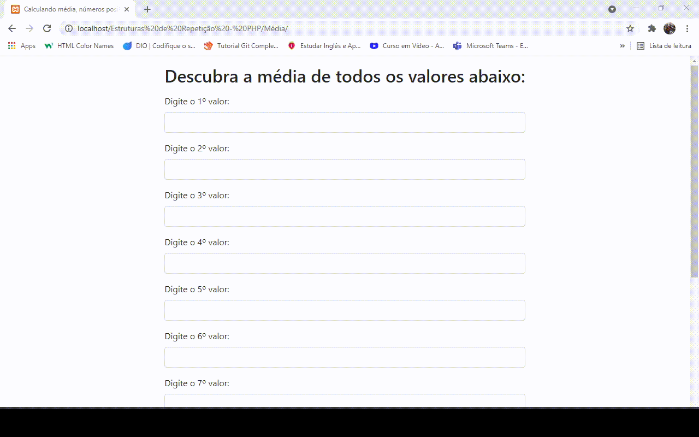

# Cálculo de média e percentual

Projeto que é possível realizar o cálculo da média de todos os números digitados, onde estão armazenados em array para seguir boas práticas de manter um código mais limpo e legível à outras pessoas.  
Também é possível visualizar o percentual dos números mais digitados, podendo ser eles positivos ou negativos. Ainda não entendeu muito bem como funciona 🤔🤔? Peraí que vou explicar adiante...  
#
**Para ficar mais esclarecedor de como funciona o sistema, siga o exemplo a seguir:** 
- Em um total de 20 números para o usuário digitar, caso ele digite 10 números negativos e o restante positivos, haverá 50% números negativos e 50% positivos. Simples assim 😄🧐.

# Resultado
